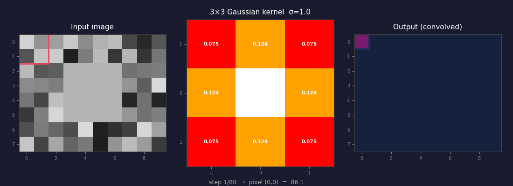
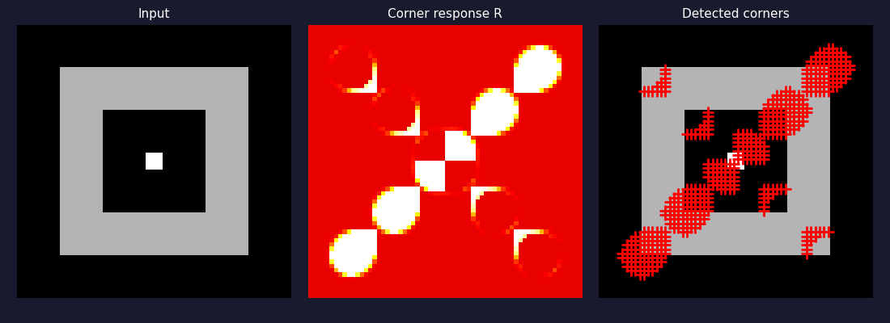
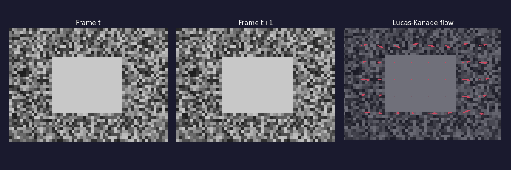
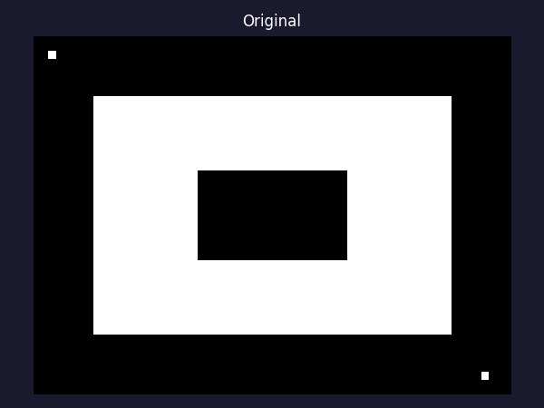
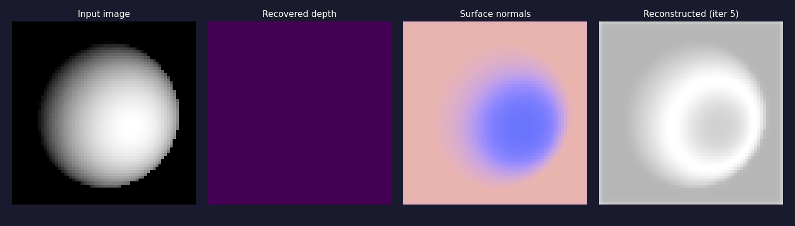
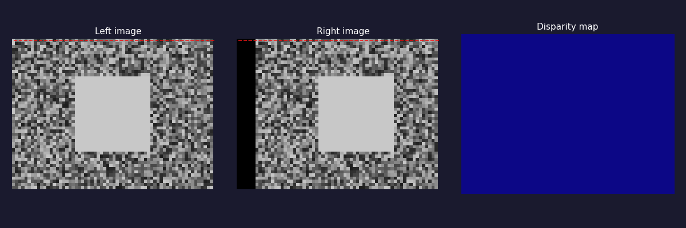

# Computer Vision — From Scratch

Ground-up implementations of core CV algorithms in pure NumPy.
Each topic has its own doc with the math, intuition, and a visual.

---

## Topics

| # | Concept | Doc | Source | Preview |
|---|---------|-----|--------|---------|
| 1 | Gaussian Blur | [docs/gaussian_blur.md](docs/gaussian_blur.md) | [src/kernel.py](src/kernel.py), [src/convolve.py](src/convolve.py) |  |
| 2 | Canny Edge Detection | [docs/canny.md](docs/canny.md) | [src/canny.py](src/canny.py) |  |
| 3 | Harris Corner Detection | [docs/harris.md](docs/harris.md) | [src/harris.py](src/harris.py) |  |
| 4 | Image Pyramids & Scale Space | [docs/pyramids.md](docs/pyramids.md) | [src/pyramids.py](src/pyramids.py) |  |
| 5 | Optical Flow | [docs/optical_flow.md](docs/optical_flow.md) | [src/optical_flow.py](src/optical_flow.py) |  |
| 6 | Morphological Operations | [docs/morphology.md](docs/morphology.md) | [src/morphology.py](src/morphology.py) |  |
| 7 | Shape from Shading | [docs/shape_from_shading.md](docs/shape_from_shading.md) | [src/shape_from_shading.py](src/shape_from_shading.py) |  |
| 8 | Stereo Vision & Disparity | [docs/stereo.md](docs/stereo.md) | [src/stereo.py](src/stereo.py) |  |

---

## Setup

```bash
pip install numpy matplotlib pillow
```

Run any module directly:

```bash
python src/canny.py
python src/harris.py
python src/pyramids.py
python src/optical_flow.py
python src/morphology.py
python src/shape_from_shading.py
python src/stereo.py
```

Regenerate all GIF visualizations:

```bash
python src/generate_assets.py
```

---

## Structure

```
src/              # implementations (pure NumPy)
docs/             # per-topic README with math and intuition
assets/           # animated GIFs for each topic
```
