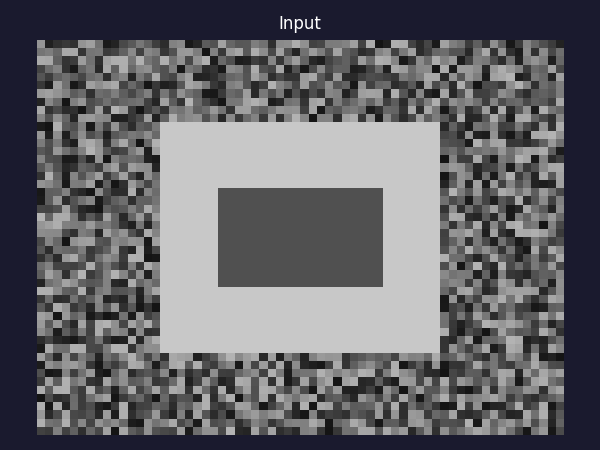

# Canny Edge Detection

A multi-stage algorithm that produces thin, well-localised edges.

---

## Pipeline

```
Image → Gaussian blur → Sobel gradients → NMS → Double threshold → Hysteresis
```

### 1. Gaussian blur

Noise is amplified by differentiation. Blurring first with σ ≈ 1 suppresses noise
without destroying edge structure.

### 2. Gradient magnitude and direction

Sobel kernels give:

```
Gx = [[-1,0,1],[-2,0,2],[-1,0,1]]    Gy = [[-1,-2,-1],[0,0,0],[1,2,1]]
```

```
M(x,y) = sqrt(Gx² + Gy²)
θ(x,y) = atan2(Gy, Gx)
```

### 3. Non-maximum suppression (NMS)

Thin wide gradient ridges to single-pixel edges.
For each pixel, quantise θ to the nearest 45° direction and check that the
gradient magnitude is a local maximum along that direction. If not, suppress.

### 4. Double threshold

Two thresholds τ_low, τ_high partition pixels:

| Region | Condition | Label |
|---|---|---|
| M ≥ τ_high | certain edge | **strong** |
| τ_low ≤ M < τ_high | possible edge | **weak** |
| M < τ_low | not an edge | discarded |

### 5. Hysteresis edge tracking

Starting from all **strong** pixels, follow 8-connected chains of **weak** pixels.
A weak pixel survives only if it connects (directly or indirectly) to a strong pixel.
This discards isolated noise responses while preserving faint but real edges.

---

## Key parameters

| Parameter | Effect |
|---|---|
| σ (blur) | Larger σ → fewer false edges, worse localisation |
| τ_high | Raise → fewer edges accepted as strong seeds |
| τ_low  | Raise → shorter, more broken edge chains |

Canny (1986) showed this is optimal under three criteria: good detection,
good localisation, and single response per edge.

---

## Visualization



---

## Code

```python
from src.canny import canny
edges = canny(image, sigma=1.0, low_thresh=0.05, high_thresh=0.15)
```

See [`src/canny.py`](../src/canny.py).
