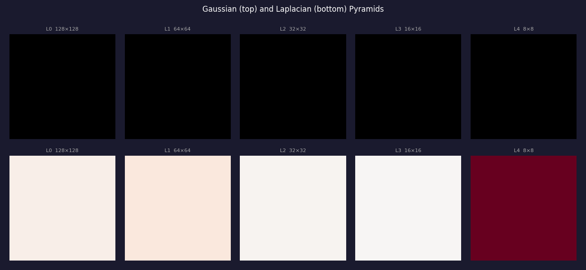

# Image Pyramids and Scale Space

Multi-scale representations used in object detection, image compression,
optical flow, and keypoint detection (SIFT).

---

## Gaussian Pyramid

Each level: blur with Gaussian σ, then downsample by 2 (keep every other pixel).

```
Level 0: H × W          (original)
Level 1: H/2 × W/2      (blurred + halved)
Level 2: H/4 × W/4
...
```

**Why blur before downsampling?** Nyquist: the new pixel spacing is 2×, so
frequencies above 1/4 of the original sample rate alias. Gaussian blur removes them.

---

## Laplacian Pyramid

Band-pass decomposition. Each level captures detail *lost* going down the Gaussian pyramid:

```
L[l] = G[l] - upsample(G[l+1])
```

The final level is the residual (lowest-frequency component).  
**Reconstruction**: sum up levels after upsampling each — exact recovery.

Used in image blending (e.g., seamless panoramas): blend Laplacian pyramids
of two images, then reconstruct.

---

## Difference of Gaussians (DoG)

Approximates the Laplacian of Gaussian (LoG):

```
DoG(x,y;σ) = G(x,y;σ) − G(x,y;kσ)     k ≈ 1.6 (SIFT)
```

Why approximate?  
Computing LoG = ∂²G/∂x² + ∂²G/∂y² is expensive; DoG needs only two Gaussian
blurs (which you already computed for the pyramid).

**SIFT keypoints** are local extrema (min/max) of DoG across both space *and* scale —
stable to changes in scale, rotation, and moderate illumination.

---

## Scale Space

Treating σ as a continuous scale parameter gives the Gaussian scale space:

```
L(x, y, σ) = G(x, y; σ) ∗ I(x, y)
```

Koenderink (1984) showed Gaussian is the *only* kernel that creates a valid
scale space (no new structures appear as scale increases).

---

## Visualization



---

## Code

```python
from src.pyramids import gaussian_pyramid, laplacian_pyramid, dog

gpyr = gaussian_pyramid(image, levels=4)
lpyr = laplacian_pyramid(image, levels=4)
dog_response = dog(image, sigma=1.0, k=1.6)
```

See [`src/pyramids.py`](../src/pyramids.py).
